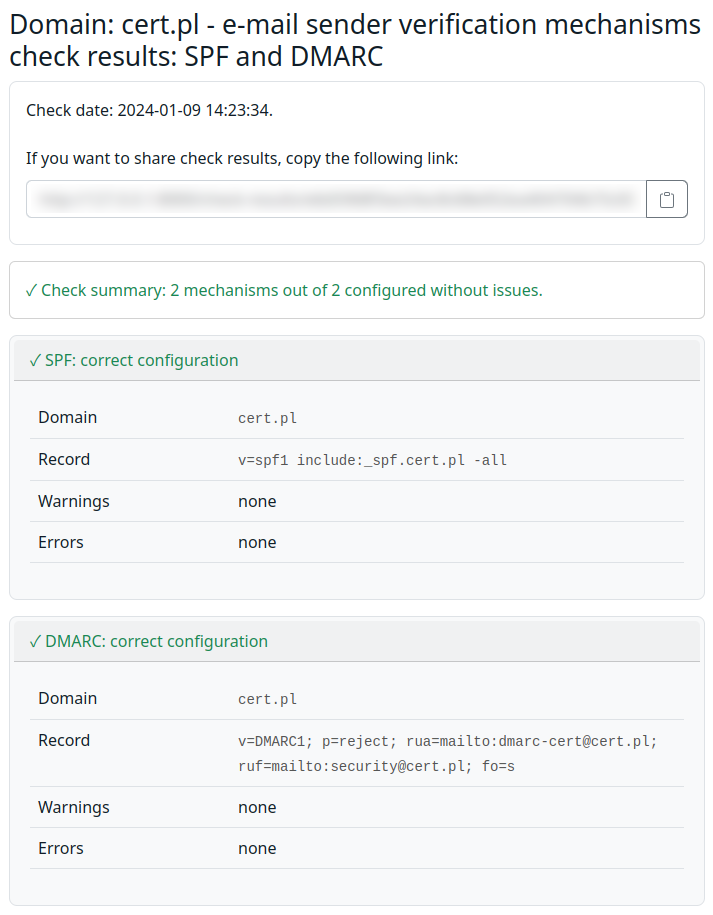

<h1>
    <picture>
        <source media="(prefers-color-scheme: dark)" srcset=".github/images/logo_dark.png">
        
    </picture>
</h1>

Mailgoose is a web application that allows the users to check whether their SPF, DMARC and
DKIM configuration is set up correctly. CERT PL uses it to run
<a href="https://bezpiecznapoczta.cert.pl/">bezpiecznapoczta.cert.pl</a>, an online service
that helps Polish institutions to configure their domains to decrease the probability of successful
e-mail spoofing.

Under the hood, Mailgoose uses <a href="https://github.com/domainaware/checkdmarc">checkdmarc</a>
and <a href="https://launchpad.net/dkimpy/">dkimpy</a>, among others.

## [Quick Start 🔨](https://mailgoose.readthedocs.io/en/latest/quick-start.html) | [Docs 📚](https://mailgoose.readthedocs.io/en/latest/)

## Features
For an up-to-date list of features, please refer to [the documentation](https://mailgoose.readthedocs.io/en/latest/features.html).

## Screenshots


## Development

### Tests
To run the tests, use:

```
./scripts/test
```

### Code formatting
Mailgoose uses `pre-commit` to run linters and format the code.
`pre-commit` is executed on CI to verify that the code is formatted properly.

To run it locally, use:

```
pre-commit run --all-files
```

To setup `pre-commit` so that it runs before each commit, use:

```
pre-commit install
```

### Building the docs

To build the documentation, use:

```
cd docs
python3 -m venv venv
. venv/bin/activate
pip install -r requirements.txt
make html
```

## Contributing
Contributions are welcome! We will appreciate both ideas for improvements (added as
[GitHub issues](https://github.com/CERT-Polska/mailgoose/issues)) as well as pull requests
with new features or code improvements.

However obvious it may seem we kindly remind you that by contributing to mailgoose
you agree that the BSD 3-Clause License shall apply to your input automatically,
without the need for any additional declarations to be made.
